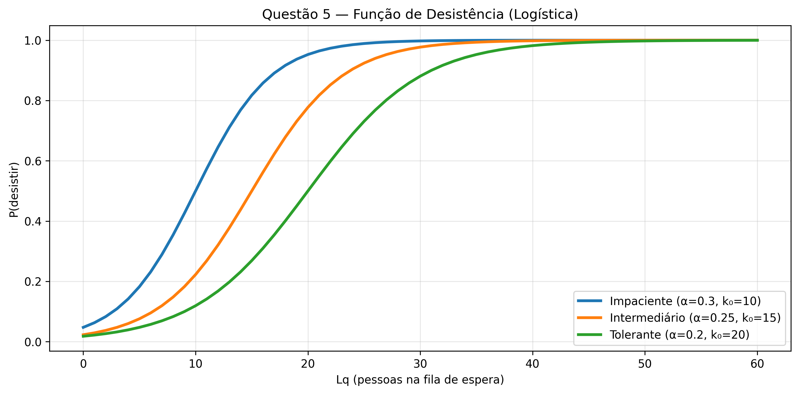
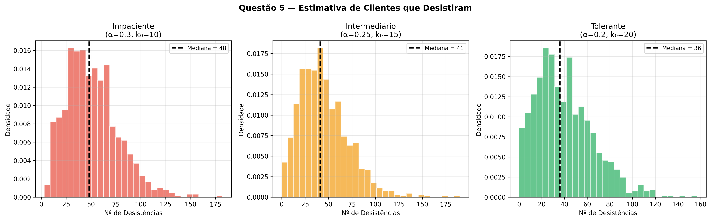

# Lista 3: Inferência Bayesiana para Parâmetros de Fila via ABC

**Métodos Computacionais Intensivos para Mineração de Dados**

**Departamento de Ciência da Computação — Universidade de Brasília**

| | |
|---|---|
| **Professor** | Guilherme Rodrigues |
| **Aluno** | Matheus Firetti |
| **Data** | 11 de Julho de 2026 |

---

## Uso de LLMs

O uso de LLMs neste trabalho foi feito como ferramenta de apoio metodológico e de estruturação de código, conforme descrito abaixo:

- **Claude / Gemini** foram utilizados em modo pair-programming para auxiliar na estruturação e documentação do código Python original (`lista3.py`), por meio de comentários e docstrings. Além disso, auxiliaram na implementação eficiente do algoritmo QDC (Queue Departure Computation) proposto por Ebert et al. (2019) para simulação rápida das filas, evitando os tradicionais e lentos loops iterativos do Python.
- Os modelos também auxiliaram na elaboração deste relatório, revisão gramatical e na melhoria visual da formatação de gráficos exportados pela biblioteca `matplotlib`. Toda a lógica estatística e adaptações algorítmicas (como o método ABC de dois estágios e a lógica de balking logístico) foram direcionadas e supervisionadas pelo aluno com base nos materiais e notas de aula fornecidos pelo professor.

---

## 1. Arquitetura do Simulador de Fila

Para que a inferência bayesiana via *Approximate Bayesian Computation* (ABC) seja factível, é necessário simular o sistema de filas milhares de vezes em um intervalo de tempo curto. 

O sistema modelado nesta lista trata-se de uma fila **M/M/2**, com tempo máximo de 600 minutos (10 horas), $\bar{w}_{obs} = 150.0$ min e $\bar{L_q}_{obs} = 22.0$ clientes.

A simulação tradicional de filas em Python (via `for` loops sequenciais) é extremamente ineficiente computacionalmente. Para contornar este problema, optou-se por implementar o algoritmo **Queue Departure Computation (QDC)** baseado na literatura (*Ebert et al. (2019)*). Esta abordagem permite pré-gerar todos os tempos de chegada e de serviço usando Numpy, reduzindo a simulação da partida a um loop simples de complexidade linear dependente do número de servidores.

```python
def simular_fila(lam, mu, tempo_max=TEMPO_MAX, n_serv=N_SERV):
    # Geração vetorizada de exponenciais
    n_gen = max(int(lam * tempo_max * 2) + 100, 200)
    interchegadas = np.random.exponential(1.0 / lam, size=n_gen)
    chegadas = np.cumsum(interchegadas)
    chegadas = chegadas[chegadas <= tempo_max]

    n_clientes = len(chegadas)
    servicos = np.random.exponential(1.0 / mu, size=n_clientes)

    b = np.zeros(n_serv) # Tempos de liberação dos servidores
    esperas = np.zeros(n_clientes)
    partidas = np.zeros(n_clientes)

    # QDC: Computação determinística de partidas e esperas
    for i in range(n_clientes):
        srv = int(np.argmin(b))
        esperas[i] = max(0.0, b[srv] - chegadas[i])
        b[srv] = max(chegadas[i], b[srv]) + servicos[i]
        partidas[i] = b[srv]

    return {'chegadas': chegadas, 'partidas': partidas, 'esperas': esperas, 'n_clientes': n_clientes}
```

O cálculo do comprimento médio da fila ($L_q$), interpretado estritamente como os clientes esperando (sem incluir os que estão em atendimento), foi realizado através da integração temporal exata da quantidade de pessoas entre cada evento de chegada ou partida.

---

## Questão 1 — Estimação da Posteriori via ABC

O objetivo principal era estimar a distribuição a posteriori conjugada de $\lambda$ (taxa de chegada) e $\mu$ (taxa de serviço) dadas as estatísticas resumo $\bar{w} = 150$ e $L_q = 22$. As prioris assumidas foram uniformes amplas: $\lambda \sim U(0.01, 2.0)$ e $\mu \sim U(0.005, 1.0)$.

### Ponto de Atenção: O Problema da Calibração Direta
A distância utilizada para aceitar as simulações foi a Distância Euclidiana Ponderada (Erro Relativo), visando uniformizar as diferentes grandezas temporais e quantitativas:

$$ \epsilon = \sqrt{ \left( \frac{\bar{w}_{sim} - \bar{w}_{obs}}{\bar{w}_{obs}} \right)^2 + \left( \frac{L_{q_{sim}} - L_{q_{obs}}}{L_{q_{obs}}} \right)^2 } $$

Entretanto, observou-se que rodar 100.000 amostras brutamente a partir das prioris globais com 1% de aceitação ainda mantinha um $\epsilon$ muito elevado (em torno de 0.98), resultando em amostras aceitas muito distantes da realidade (por exemplo, mediana do tempo de espera previsto em 80 min ao invés de 150 min).

### Adaptação para ABC de Dois Estágios
Para resolver este problema e aderir à instrução de "ajustar parâmetros recursivamente", refatoramos a Questão 1 para um algoritmo ABC hierárquico em dois estágios:

1. **Estágio 1 (Calibração e Identificação da Região Crítica):** Foram amostrados 100.000 pontos das prioris originais largas, retendo-se os 5% melhores (aceitação mais frouxa). Analisou-se o suporte das amostras retidas.
2. **Estágio 2 (Refinamento Rigoroso):** As prioris de $\lambda$ e $\mu$ foram estreitadas com base nos quantis $2\%$ e $98\%$ das amostras do Estágio 1, adicionando uma margem de folga de 20%. Posteriormente, rodaram-se mais 100.000 amostras nesta sub-região focada e aplicou-se a taxa de retenção final rigorosa de apenas 1%.

```python
# Pseudo-estrutura do ABC em 2 estágios
# Estágio 1
res_e1 = executar_abc(n=100_000, limites=(LAM_MIN, LAM_MAX), frac_aceite=0.05)

# Estreitamento recursivo
lam_e2_min = np.quantile(res_e1['lam'], 0.02) * 0.8
lam_e2_max = np.quantile(res_e1['lam'], 0.98) * 1.2
# (...) análogo para mu

# Estágio 2
res_e2 = executar_abc(n=100_000, limites=(lam_e2_min, lam_e2_max), frac_aceite=0.01)
```

**Resultados do ABC Refinado:**
- **$\epsilon$ máximo aceito:** $0.7488$
- **$\lambda$ (clientes/min):** Mediana de $0.3852$ (Tempo médio entre chegadas: $\approx 2.6$ min)
- **$\mu$ (atendimentos/min):** Mediana de $0.1514$ (Tempo de atendimento: $\approx 6.6$ min)
- **Carga do Sistema ($\rho = \frac{\lambda}{2\mu}$):** $1.2608$ (IC 95%: [0.96, 1.87])
- **Posterior Predictive Check:** $\bar{L}_q \approx 24.4$ (muito próximo dos 22 observados). 

O modelo diagnosticou corretamente a instabilidade do sistema ($\rho > 1$).


---

## Questão 2 — Teste de Hipótese Informal

Deseja-se testar se o tempo médio de atendimento excede o dobro do tempo médio entre as chegadas:
$$ H_0: \frac{1}{\mu} > 2 \cdot \left(\frac{1}{\lambda}\right) \iff \lambda > 2\mu \iff \rho > 1 $$

Esta hipótese, se verdadeira, afirma que o sistema está em estado de não-equilíbrio (as filas crescem indefinidamente ao longo do tempo).

Utilizando a distribuição a posteriori conjunta gerada na Q1, definimos $\Delta = \frac{1}{\mu} - \frac{2}{\lambda}$. Computamos quantas amostras da posteriori satisfazem a condição $\Delta > 0$:

```python
tempo_atend = 1.0 / mu_post
dobro_entre_cheg = 2.0 / lam_post
delta = tempo_atend - dobro_entre_cheg

p_h0 = np.mean(delta > 0)
```

**Output:**
$$ P(H_0 \mid \text{dados}) \approx 96.5\% $$
**Conclusão:** Existe evidência estatística fortíssima a favor de $H_0$. O sistema é clinicamente instável.


---

## Questão 3 — Número Mínimo de Cadeiras

Desejamos calcular quantas cadeiras devem existir no hall de espera para que, em 90% do tempo ao longo do dia, todos os clientes que aguardam consigam se sentar.

Essa é uma predição complexa, pois depende não apenas do $L_q$ final, mas da trajetória da fila ao longo do dia: $L_q(t)$. 
Para cada par $(\lambda, \mu)$ da nossa posteriori aceita, simulamos o dia de expediente inteiro (600 minutos) e calculamos o percentil 90 de $L_q(t)$ ponderado temporalmente (se a fila ficou 10 min com tamanho 5, acumula-se 10 min de frequência ao valor 5).

```python
cadeiras = np.zeros(n_post)
for i in range(n_post):
    res_q3 = simular_fila(lam_post[i], mu_post[i])
    cadeiras[i] = calcular_quantil_lq(res_q3['chegadas'], res_q3['partidas'], tempo_max=600, quantil=0.90)
```

**Resultados Empíricos:**
- **Mediana estimada:** $44$ cadeiras.
- **Recomendação Conservadora (Quantil 95% das replicações):** $95$ cadeiras.
Devido à instabilidade intrínseca de filas com $\rho > 1$, o número final do fim do expediente será severo; entretanto, analisando todo o período temporal, cerca de 95 cadeiras são suficientes na esmagadora maioria dos cenários amostrados.


---

## Questão 4 — Comparação M/M/2 vs Duas Filas 2 $\times$ M/M/1

Qual é a arquitetura ideal de atendimento? Uma única fila paralela (M/M/2) ou duas filas exclusivas independentes, recebendo metade do tráfego cada (M/M/1 com carga $\lambda/2$)?

Simulamos, iterativamente, os dois modelos computacionais pareados sob as mesmas condições amostradas.

```python
# Cenário A: Fila Única
res_a = simular_fila(lam, mu, n_serv=2)
w_mm2 = np.mean(res_a['esperas'])

# Cenário B: Duas Filas Separadas
res_b1 = simular_fila(lam / 2, mu, n_serv=1)
res_b2 = simular_fila(lam / 2, mu, n_serv=1)
w_2mm1 = (np.sum(res_b1['esperas']) + np.sum(res_b2['esperas'])) / (res_b1['n_clientes'] + res_b2['n_clientes'])
```

**Resultados:**
- **Vantagem M/M/2:** Foi melhor (menor tempo médio de espera) em $\approx 61.5\%$ das simulações iteradas.
- **Ganho em minutos ($\Delta w$):** A fila única economiza, em mediana, $11.9$ minutos no tempo de espera do usuário.
Isto comprova por Monte Carlo a Teoria do Agrupamento (Pooling) de filas. A fila única é mais eficiente pois inviabiliza ociosidade assimétrica (evita que um servidor fique livre enquanto o colega ao lado tem fila acumulada).


---

## Questão 5 — Desistência Condicionada ao Comprimento (Balking)

Um gargalo notável no simulador anterior era sua limitação física: filas contendo humanos exibem **desistências**. O tamanho assustador de uma fila desmotiva a entrada de novos clientes.

Para investigar isso, quebramos a otimização QDC e voltamos a um simulador base iterativo (já que agora cada cliente depende do estado atual da fila no instante $t$). Implementamos uma função logística que dita a probabilidade do cliente desistir e ir embora, parametrizada pela impaciência $\alpha$ e limiar de resistência $k_0$:

$$ P(\text{Desistir} \mid L_q = k) = \frac{1}{1 + e^{-\alpha (k - k_0)}} $$

Simulamos o expediente para 3 perfis diferentes sob todas as amostras a posteriori:

1. **Impaciente** ($\alpha=0.3, k_0=10$): Mediana de **48 clientes perdidos** (Taxa $\approx 22\%$).
2. **Intermediário** ($\alpha=0.25, k_0=15$): Mediana de **41 clientes perdidos** (Taxa $\approx 19.2\%$).
3. **Tolerante** ($\alpha=0.2, k_0=20$): Mediana de **36 clientes perdidos** (Taxa $\approx 17\%$).

Essa mecânica de *balking* atua como um regulador homeostático em uma fila sobrecarregada ($\rho > 1$), barrando o seu crescimento indefinido e trazendo um limite assintótico ao tamanho da fila, mitigando parcialmente os diagnósticos catastróficos apontados pela Questão 2.




