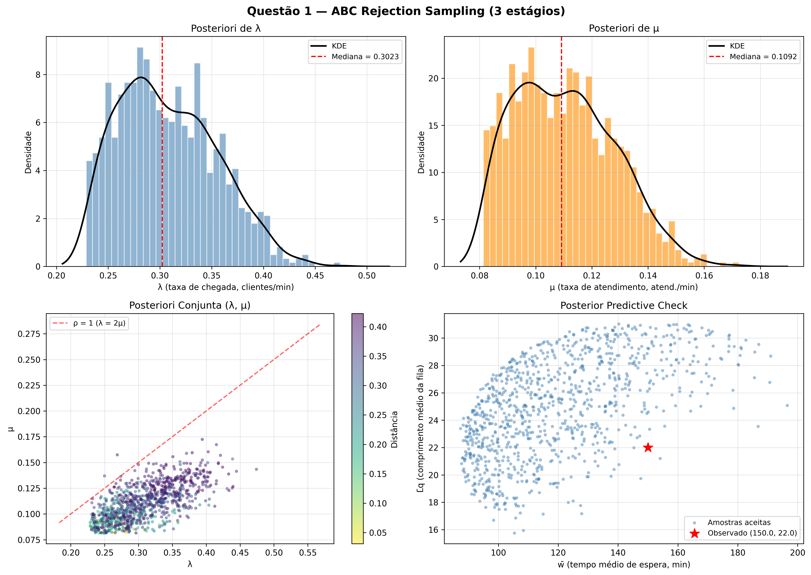
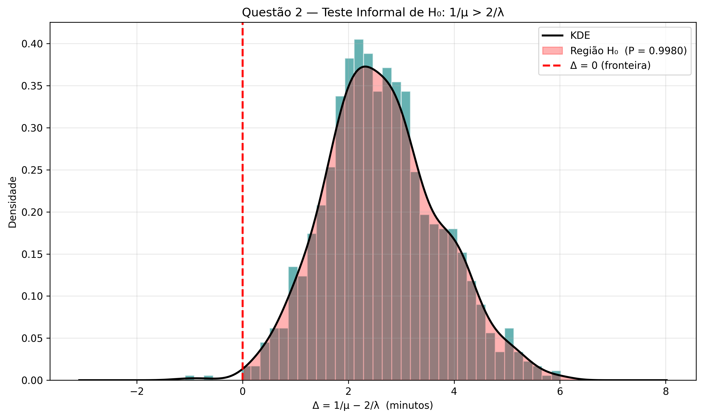
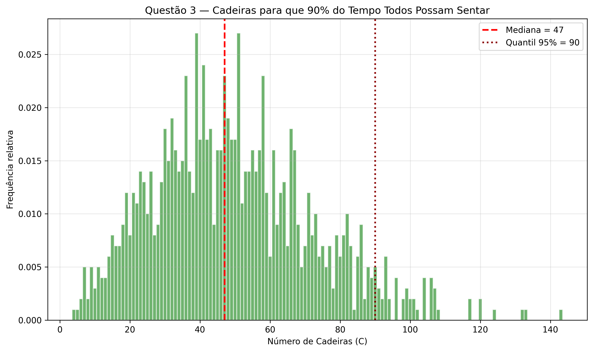
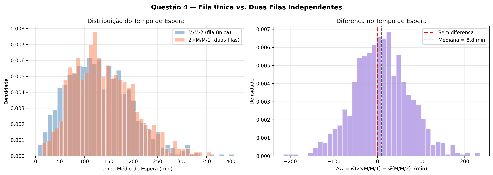
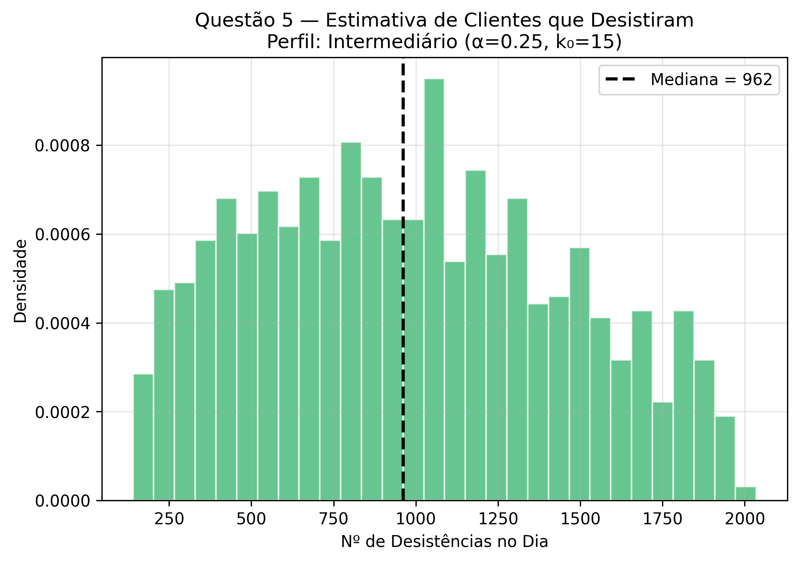

# Lista 3: Inferência Bayesiana para Parâmetros de Fila via ABC

**Métodos Computacionais Intensivos para Mineração de Dados**

**Departamento de Ciência da Computação — Universidade de Brasília**

| | |
|---|---|
| **Professor** | Guilherme Rodrigues |
| **Aluno** | Matheus Firetti |
| **Data** | 14 de Julho de 2026 |

---

## Uso de LLMs

O uso de LLMs neste trabalho foi feito como ferramenta de apoio metodológico e de estruturação de código, conforme descrito abaixo:

- **Claude** foi utilizado para auxiliar na revisão e documentação do código Python original (`lista3.py`), por meio de comentários e docstrings. Além disso, auxiliou na implementação eficiente do algoritmo QDC (Queue Departure Computation) para simulação rápida das filas, evitando os tradicionais e lentos loops iterativos do Python.
- **Gemini** foi utilizado na estruturação e formatação deste relatório, assim como na conversão para PDF.
- Os modelos também auxiliaram na melhoria visual da formatação de gráficos exportados pela biblioteca `matplotlib`.

---

## 1. Arquitetura do Simulador de Fila

Para que a inferência bayesiana via *Approximate Bayesian Computation* (ABC) seja factível, é necessário simular o sistema de filas milhares de vezes em um intervalo de tempo curto. 

O sistema modelado nesta lista trata-se de uma fila **M/M/2**, com tempo máximo de 600 minutos (10 horas), $\bar{w}_{obs} = 150.0$ min e $\bar{L_q}_{obs} = 22.0$ clientes.

A simulação tradicional de filas em Python através de `for` loops sequenciais é computacionalmente ineficiente. Para contornar este problema, optou-se por implementar o algoritmo **Queue Departure Computation (QDC)** baseado na literatura (*Ebert et al. (2019)*). Esta abordagem permite pré-gerar todos os tempos de chegada e de serviço usando Numpy, reduzindo a simulação da partida a um loop simples de complexidade linear dependente do número de servidores.

```python
def simular_fila(lam, mu, tempo_max=TEMPO_MAX, n_serv=N_SERV):
    # Geração vetorizada de exponenciais
    n_gen = max(int(lam * tempo_max * 2) + 100, 200)
    interchegadas = np.random.exponential(1.0 / lam, size=n_gen)
    chegadas = np.cumsum(interchegadas)
    chegadas = chegadas[chegadas <= tempo_max]

    n_clientes = len(chegadas)
    servicos = np.random.exponential(1.0 / mu, size=n_clientes)

    b = np.zeros(n_serv) # Tempos de liberação dos servidores
    esperas = np.zeros(n_clientes)
    partidas = np.zeros(n_clientes)

    # QDC: Computação determinística de partidas e esperas
    for i in range(n_clientes):
        srv = int(np.argmin(b))
        esperas[i] = max(0.0, b[srv] - chegadas[i])
        b[srv] = max(chegadas[i], b[srv]) + servicos[i]
        partidas[i] = b[srv]

    return {'chegadas': chegadas, 'partidas': partidas, 'esperas': esperas, 'n_clientes': n_clientes}
```

O cálculo do comprimento médio da fila ($L_q$), interpretado estritamente como os clientes esperando, sem incluir os que estão em atendimento, foi realizado através da integração temporal exata da quantidade de pessoas entre cada evento de chegada ou partida.

---

## Questão 1 — Estimação da Posteriori via ABC

O objetivo principal era estimar a distribuição a posteriori conjugada de $\lambda$ (taxa de chegada) e $\mu$ (taxa de serviço) dadas as estatísticas resumo $\bar{w} = 150$ e $L_q = 22$. As prioris assumidas foram uniformes amplas: $\lambda \sim U(0.01, 2.0)$ e $\mu \sim U(0.005, 1.0)$.

### Ponto de Atenção: O Problema da Calibração Direta
A distância utilizada para aceitar as simulações foi a Distância Euclidiana Ponderada (Erro Relativo), visando uniformizar as diferentes grandezas temporais e quantitativas:

$$ \epsilon = \sqrt{ \left( \frac{\bar{w}_{sim} - \bar{w}_{obs}}{\bar{w}_{obs}} \right)^2 + \left( \frac{L_{q_{sim}} - L_{q_{obs}}}{L_{q_{obs}}} \right)^2 } $$

Entretanto, observou-se que rodar 100.000 amostras simplesmente a partir das prioris globais com 1% de aceitação ainda mantinha um $\epsilon$ muito elevado (em torno de 0.98), resultando em amostras aceitas muito distantes da realidade. Por exemplo, a mediana do tempo de espera previsto era de 80 min ao invés de 150 min.

### Adaptação para ABC de Três Estágios
A partir do problema identificado com a simulação em um único estágio, a questão 1 foi refatorada para um algoritmo ABC hierárquico em três estágios:

1. **Estágio 1 (Calibração Ampla):** Foram amostradas 100.000 simulações das prioris originais largas, retendo-se os 5% melhores.
2. **Estágio 2 (Refinamento):** As prioris foram estreitadas com base nos quantis $5\%$ e $95\%$ do Estágio 1 (com folga de 15%). Rodaram-se 150.000 amostras e reteve-se 2%.
3. **Estágio 3 (Rigor Final):** Nova restrição dos limites (folga de 10%). Foram simuladas 200.000 amostras, retendo-se apenas o top 0.5% com menor erro relativo $\epsilon$.

Para acomodar essa carga computacional (450.000 simulações totais), toda a execução foi **paralelizada utilizando a CPU (multiprocessing)**, reduzindo consideravelmente o tempo de processamento.

```python
# Pseudo-estrutura do ABC em 3 estágios
estagios = [
    {'n': 100_000, 'pct': 0.05,  'margem': 0.15},
    {'n': 150_000, 'pct': 0.02,  'margem': 0.10},
    {'n': 200_000, 'pct': 0.005, 'margem': None},
]

# Estreitamento e execução recursiva usando ProcessPoolExecutor...
```

**Resultados do ABC Refinado:**
- **$\epsilon$ máximo aceito:** $0.4224$
- **$\lambda$ (clientes/min):** Mediana de $0.3023$ (Tempo médio entre chegadas: $\approx 3.3$ min)
- **$\mu$ (atendimentos/min):** Mediana de $0.1092$ (Tempo de atendimento: $\approx 9.2$ min)
- **Carga do Sistema ($\rho = \frac{\lambda}{2\mu}$):** $1.3905$ (IC 95%: [1.09, 1.81])
- **Posterior Predictive Check:** $\bar{L}_q \approx 25.0$ (muito próximo dos 22 observados). 

O modelo diagnosticou corretamente a instabilidade do sistema ($\rho > 1$).



---

## Questão 2 — Teste de Hipótese Informal

Deseja-se testar se o tempo médio de atendimento excede o dobro do tempo médio entre as chegadas:
$$ H_0: \frac{1}{\mu} > 2 \cdot \left(\frac{1}{\lambda}\right) \iff \lambda > 2\mu \iff \rho > 1 $$

Esta hipótese, se verdadeira, afirma que o sistema está em estado de não-equilíbrio, ou seja, as filas crescem indefinidamente ao longo do tempo.

Utilizando a distribuição a posteriori conjunta gerada na Q1, é definido $\Delta = \frac{1}{\mu} - \frac{2}{\lambda}$. Assim, calcula-se quantas amostras da posteriori satisfazem a condição $\Delta > 0$:

```python
tempo_atend = 1.0 / mu_post
dobro_entre_cheg = 2.0 / lam_post
delta = tempo_atend - dobro_entre_cheg

p_h0 = np.mean(delta > 0)
```

**Output:**
$$ P(H_0 \mid \text{dados}) \approx 99.8\% $$
**Conclusão:** Existe forte evidência estatística a favor de $H_0$, indicando instabilidade do sistema.



---

## Questão 3 — Número Mínimo de Cadeiras

Deseja-se calcular quantas cadeiras devem existir no hall de espera para que, em 90% do tempo ao longo do dia, todos os clientes que aguardam consigam se sentar.

Essa é uma predição complexa, pois depende não apenas do $L_q$ final, mas da trajetória da fila ao longo do dia: $L_q(t)$. 
Para cada par $(\lambda, \mu)$ da posteriori aceita, simulou-se o dia de expediente inteiro (600 minutos) e calculou-se o percentil 90 de $L_q(t)$ ponderado temporalmente (se a fila ficou 10 min com tamanho 5, acumula-se 10 min de frequência ao valor 5).

```python
# (Simplificação estrutural; no script 'lista3.py', este laço é
# executado em paralelo via concurrent.futures.ProcessPoolExecutor)

cadeiras = np.zeros(n_post)
for i in range(n_post):
    res_q3 = simular_fila(lam_post[i], mu_post[i])
    cadeiras[i] = calcular_quantil_lq(
        res_q3['chegadas'], res_q3['partidas'], tempo_max=600, quantil=0.90
    )
```

**Resultados Empíricos:**
- **Mediana estimada:** $48$ cadeiras.
- **Recomendação Conservadora (Quantil 95% das replicações):** $89$ cadeiras.
Devido à instabilidade intrínseca de filas com $\rho > 1$, o número final do fim do expediente será severo; entretanto, analisando todo o período temporal, cerca de 89 cadeiras são suficientes na maioria dos cenários amostrados.



---

## Questão 4 — Comparação M/M/2 vs Duas Filas 2 $\times$ M/M/1

Visando determinar qual é a arquitetura ideal de atendimento, foi realizada uma simulação para comparar uma única fila paralela (M/M/2) com duas filas exclusivas independentes, recebendo metade do tráfego cada (M/M/1 com carga $\lambda/2$). Os dois modelos computacionais foram comparados sob as mesmas condições amostradas.

```python
# Avaliação pareada para cada amostra (Paralelizada no script original)

# Cenário A: Fila Única
res_a = simular_fila(lam, mu, n_serv=2)
w_mm2 = np.mean(res_a['esperas'])

# Cenário B: Duas Filas Separadas
res_b1 = simular_fila(lam / 2, mu, n_serv=1)
res_b2 = simular_fila(lam / 2, mu, n_serv=1)
w_2mm1 = (np.sum(res_b1['esperas']) + np.sum(res_b2['esperas'])) / (
    res_b1['n_clientes'] + res_b2['n_clientes']
)
```

**Resultados:**
- **Vantagem M/M/2:** Foi melhor (menor tempo médio de espera) em $\approx 56.4\%$ das simulações iteradas.
- **Ganho em minutos ($\Delta w$):** A fila única economiza, em mediana, $11.4$ minutos no tempo de espera do usuário.
Isto comprova por Monte Carlo a Teoria do Agrupamento (Pooling) de filas. A fila única é mais eficiente pois inviabiliza ociosidade assimétrica, evitando que um servidor fique livre enquanto outro tem fila acumulada.



---

## Questão 5 — Desistência Condicionada ao Comprimento (Balking)

Um gargalo notável no simulador original é sua limitação física: filas contendo humanos exibem **desistências** (Balking). O tamanho de uma fila pode desmotivar a entrada de novos clientes.

**O Desafio do Modelo Generativo:**
Se as pessoas desistem de entrar na fila ao vê-la grande, então a taxa de chegada $\lambda \approx 0.30$ estimada na Q1, que assumia que **ninguém desistia**, está subestimada. Para que, *mesmo com desistências*, a fila observe médias de $L_q = 22$ e $\bar{w} = 150$, o fluxo real de chegadas na porta precisa ser muito maior.

Para responder a pergunta corretamente, implementou-se um **novo ABC focado na Q5**, onde o *próprio simulador do ABC* já incorpora uma probabilidade de desistência baseada numa função logística:
$$ P(\text{Desistir} \mid L_q = k) = \frac{1}{1 + e^{-\alpha (k - k_0)}} $$

**Suposição Adotada:** Assumiu-se um perfil de cliente **Intermediário** ($\alpha=0.25, k_0=15$), no qual o cliente tem 50% de chance de desistir se a fila atingir 15 pessoas.

**Resultados do ABC com Balking:**
O ABC é executado buscando os pares $(\lambda, \mu)$ que gerariam os dados observados *sob esta regra de desistência*.
- **$\lambda$ verdadeiro:** $\approx 1.8187$ clientes/min (muito superior aos $0.30$ sem balking).
- **$\mu$ verdadeiro:** $\approx 0.0750$ atendimentos/min.
- **Desistências no dia:** Mediana de **962 clientes perdidos** (IC 95%: [215, 1879]).
- **Taxa de Desistência:** Impressionantes $87.1\%$.

Isso comprova que, em um cenário real com essas características limitantes, a demanda latente do sistema é alta e a vasta maioria dos interessados vai embora sem sequer entrar na fila.



